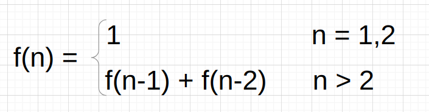
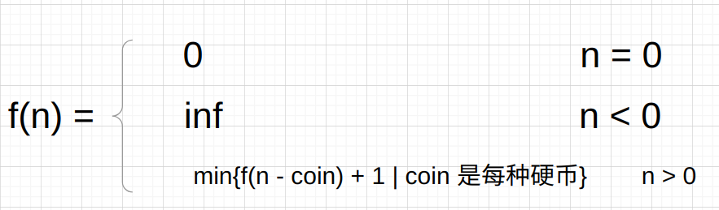

# 动态规划问题

## 1 动态规划的含义

动态规划问题的一般形式就是求最值。动态规划其实是运筹学的一种最优化方法，比如求最长递增子序列，求最小编辑距离。

## 2 解题思路

* 穷举是动态规划问题的最简单，也是最暴力的解题思路。
* 动态规划问题一般存在**重叠子问题**，需要**备忘录**或者**DP table**来优化穷举过程。
* 写出状态转移方程。

## 3 写出状态转移方程的思路

* 这个问题的**base case**(最简单的情况)是什么
* 这个问题有什么**状态**。
* 对于每个状态，可以做出怎样的选择使得状态改变。
* 如何定义**dp**数组来表现**状态**和**转移**。

### 3.1 Fibonacci问题的状态转移方程

### 3.2 投硬币问题的状态转移方程

