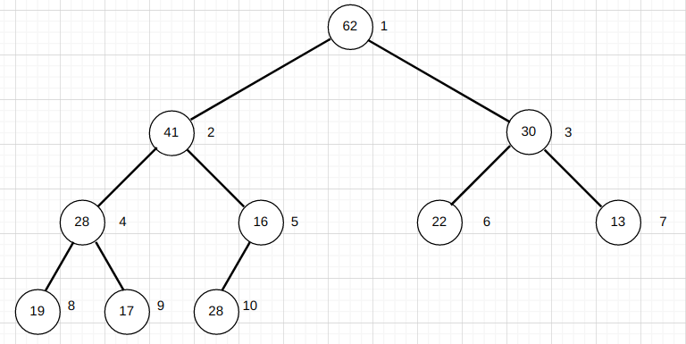
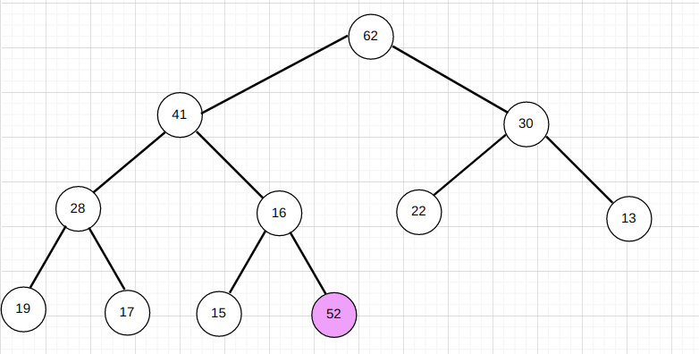
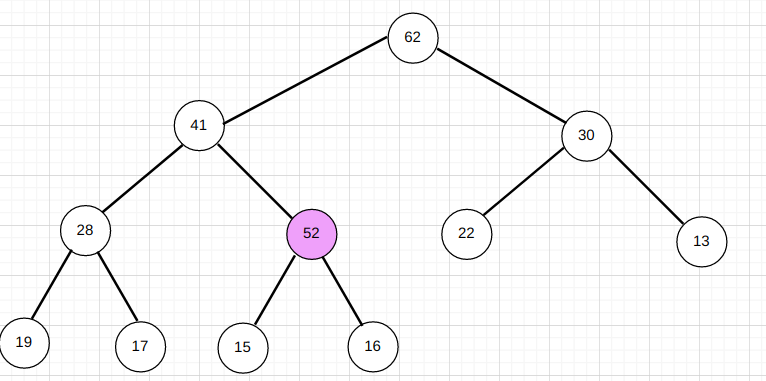
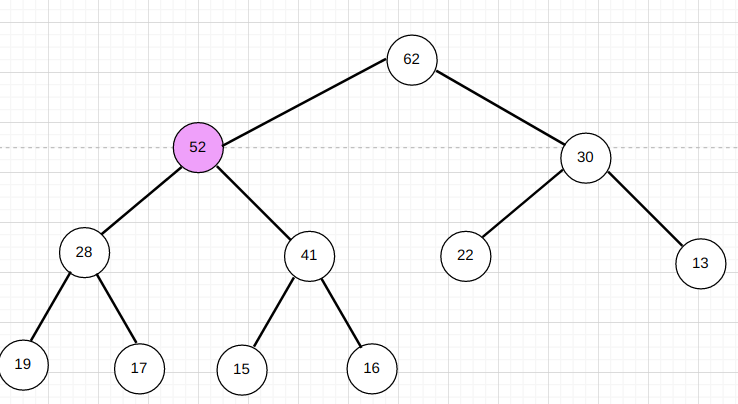
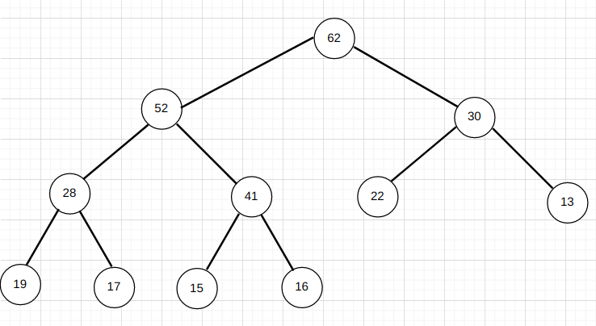
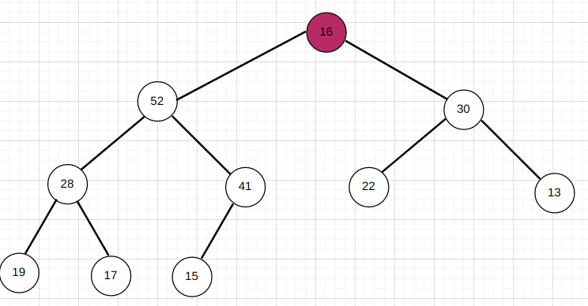
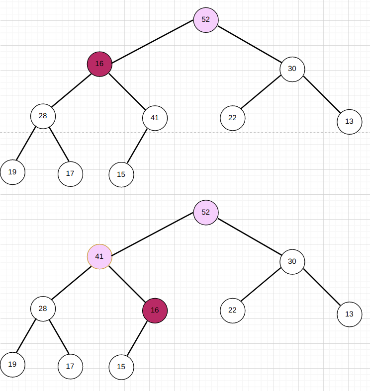
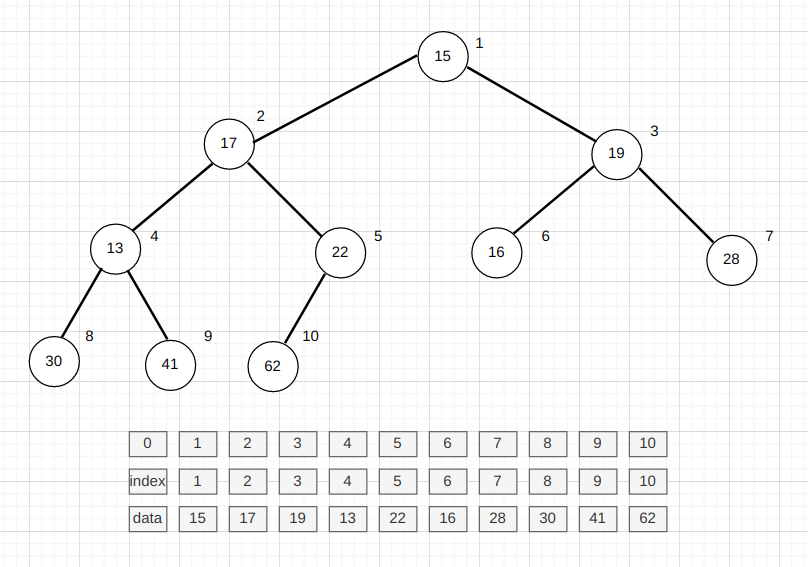
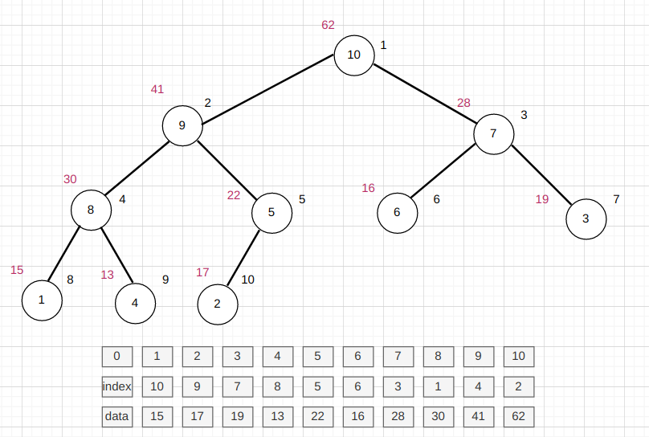

# 1. 堆与堆排序

## 1.1 优先队列

优先队列的三种实现:

|  | 入队 | 出队 |
| -------- | -------- | -------- |
| 普通数组   | 1 | O(n) |
| 顺序数组   | O(n) | 1 |
| 堆        | O(lgn)|O(lgn)|


在优先队列中，大量使用堆这个数据结构。 设想这样一种场景: 在N个元素中选出前M个元素，以下面两种数据结构:
1. 普通排序，一般复杂度为 **NlogN**，最差为 **N*N**
2. 堆，复杂度为 **NlogM**

## 1.2 二叉堆

### 1.2.1 定义

有最大堆和最小堆两种类型

最大堆性质:

* 堆中每个节点的值总是不大于其父节点的值；
* 堆总是一颗完全二叉树;

最小堆性质:

* 堆中每个节点的值总是不小于其父节点的值；
* 堆总是一颗完全二叉树;

代码实现

```java
public class BinaryHeap {
    private int[] data;
    int count;

    public BinaryHeap(int capacity) {
        this.data = new int[capacity + 1];
        this.count = 0;
    }
}
```

### 1.2.2 完全二叉树性质

* 第一个非叶子节点的序号是 元素总数 / 2

### 1.2.3 存储方式

用数组存储二叉堆,数组从1开始使用



有如下三个公式

* parent(i) = i / 2
* left child(i) = 2 * i
* right child(i) = 2 * i + 1

### 1.2.4 ShiftUp

`ShiftUp`是向一个堆中添加一个元素的过程

如：向堆中添加一个元素52



查看新加入的节点数值是否比父节点大，大的话交换位置



在新的位置上，继续与父节点比较，直至比父节点小为止



代码实现:

```java
   private void shiftUp(int index){
        while (index > 1 && data[index /2 ] < data[index]){
            SortUtil.swap(data,index ,index / 2);
            index = index / 2;
        }
    }

```

### 1.2.5 ShiftDown

`ShiftDown`是取出堆中最大元素，而后重新排序整个堆的过程

如：取出堆中最大元素(62)



取出62，将最后一个元素16放到第一个位置



16和左右孩子比较
如果比左右孩子都大，则完成
反之，与左右孩子中较大的一方交换位置



代码实现

```java
  private void shiftDown(int index){
        while (2 * index <= this.count){
            int j = 2 * index;
            if(j + 1 <= count && this.data[j + 1] > data[j]){
                j += 1;
            }
            if(this.data[index] >= data[j]){
                break;
            }
            SortUtil.swap(data,index ,j);
            index = j;
        }

    }
```

### 1.2.6 Heapify

Heapify是将一个数组转换为一个二插堆的过程。其过程为:首先按照数组中顺序将所有元素排列在堆中，而后从第一个不是叶子节点的位置(n/2)开始，进行ShiftDown操作。

* 而将n个元素逐个插入到一个空堆中，算法复杂度为O(nlogn)
* Heapify的算法复杂度为O(n)

代码实现

```java
 public BinaryHeap(int[] data){
        int length = data.length;
        this.data = new int[length + 1];
        for(int i = 0 ; i < length ; i ++){
        this.data[i + 1] = data[i];
        }
        this.count = length;

        for(int i = this.count / 2 ; i >= 1 ; i --){
          this.shiftDown(i);
        }
}

```

## 1.3 索引堆

构建堆的过程只是索引的位置发生交换,数据的位置不用更换。索引堆的使用场景为元素占用较大存储空间，元素本身不便于交换。

例如:



经过排序后:


