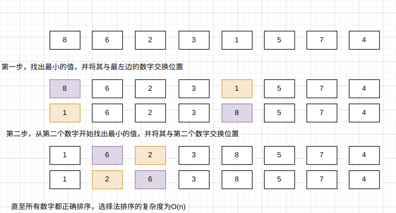
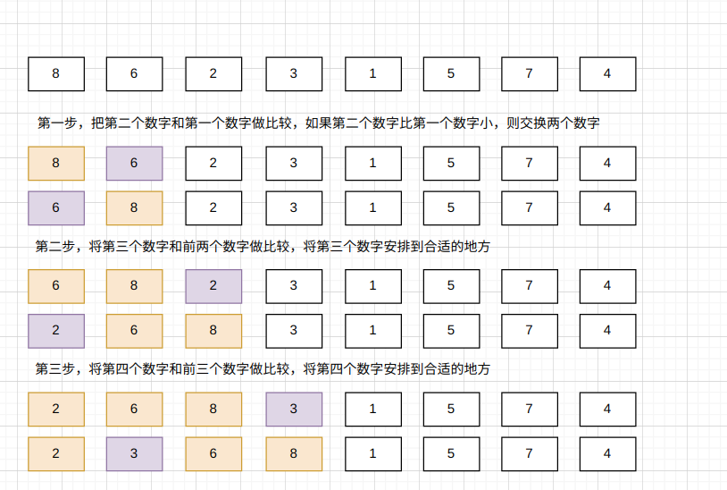
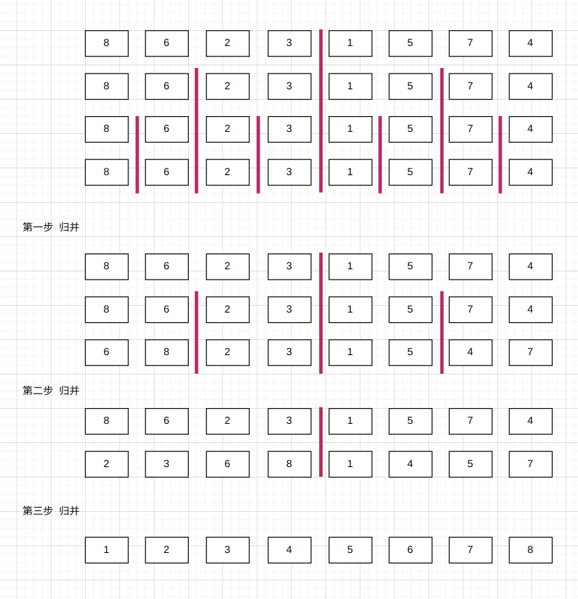

# 排序算法

## 1、 O(n*n)的排序算法

### 1.1、选择法排序



```java
public class SelectionSort {
    void selectionSort(int[] arr) {
        int n = arr.length;
        for (int i = 0; i < n; i++) {
            // 寻找[i,n)区间内的最小值
            int minIndex = i;
            for (int j = i + 1; j < n; j++) {
                if (arr[j] < arr[minIndex]) {
                    minIndex = j;
                }
            }
            int temp = arr[minIndex];
            arr[minIndex] = arr[i];
            arr[i] = temp;
        }
        for (int i = 0; i < n; i++) {
            System.out.print(String.format("%d ", arr[i]));
        }
    }
}
```

### 1.2、插入法排序



```java
public class InsertionSort {
    void insertionSort(int[] arr) {
        for (int i = 1; i < arr.length; i++) {
            int idx = -1;
            for (int j = 0; j <= i - 1; j++) {
                if (arr[j] > arr[i]) {
                    idx = j;
                    break;
                }
            }
            if (idx != -1) {
                int temp = arr[i];
                for (int k = i; k > idx; k--) {
                    arr[k] = arr[k - 1];
                }
                arr[idx] = temp;
            }
        }
        for (int i = 0; i < arr.length; i++) {
            System.out.print(String.format("%d ", arr[i]));
        }
    }
}
```

在数组近乎于有序的情况下，插入法排序效率甚至会优于O(log(n))的排序算法。

## 2、 O(n*log(n))的排序算法

### 2.1、 归并法排序



```java

public class MergeSort {
    void merge(int[] arr, int left, int mid, int right) {
        int[] temp = new int[right - left + 1];
        for (int i = left; i <= right; i++) {
            temp[i - left] = arr[i];
        }
        int i = left;
        int j = mid + 1;
        for (int k = left; k <= right; k++) {
            if (i > mid) {
                arr[k] = temp[j - left];
                j++;
            } else if (j > right) {
                arr[k] = temp[i - left];
                i++;
            } else if (temp[i - left] < temp[j - left]) {
                arr[k] = temp[i - left];
                i++;
            } else {
                arr[k] = temp[j - left];
                j++;
            }
        }
    }

    void mergeSort(int[] arr, int left, int right) {
        if (left >= right) {
            return;
        }
        int mid = (left + right) / 2;
        mergeSort(arr, left, mid);
        mergeSort(arr, mid + 1, right);
        merge(arr, left, mid, right);
    }

    void mergeSort(int[] arr) {
        mergeSort(arr, 0, arr.length - 1);
    }
}
```