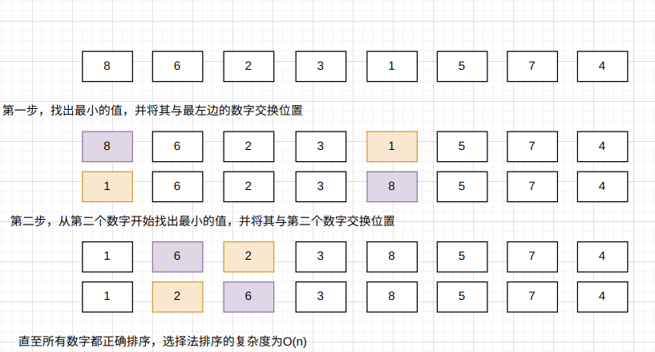
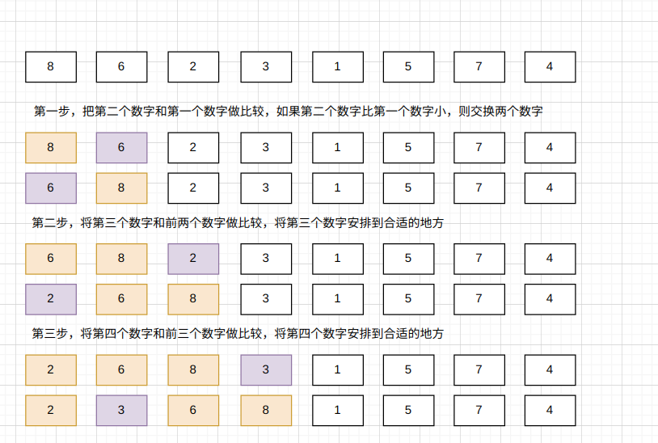
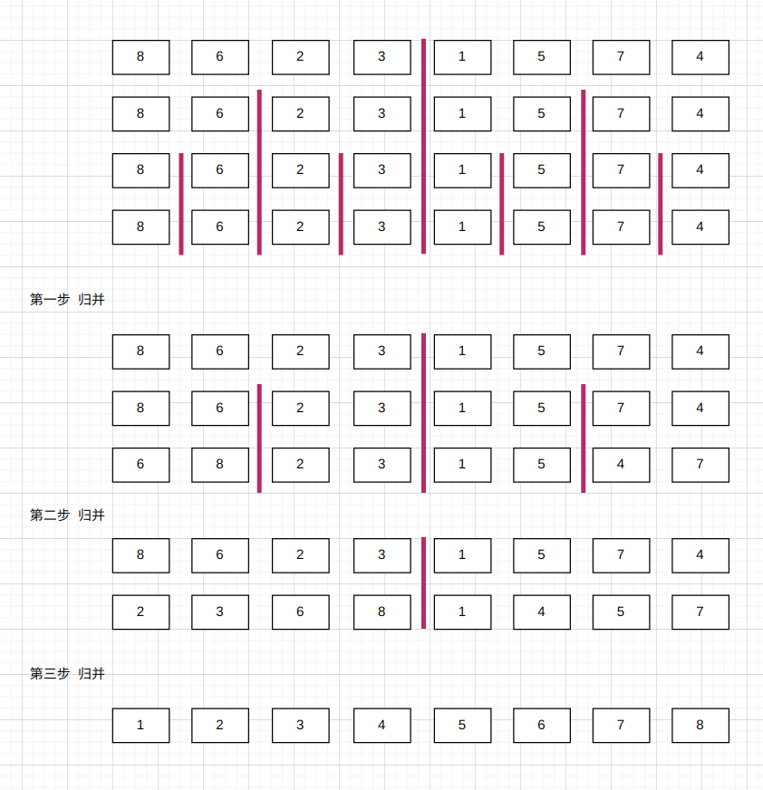
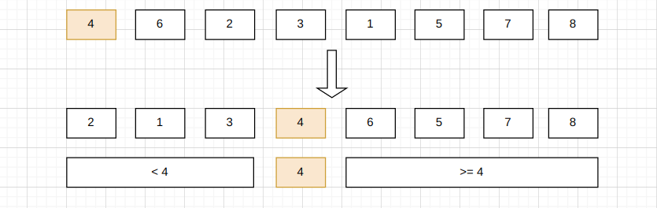
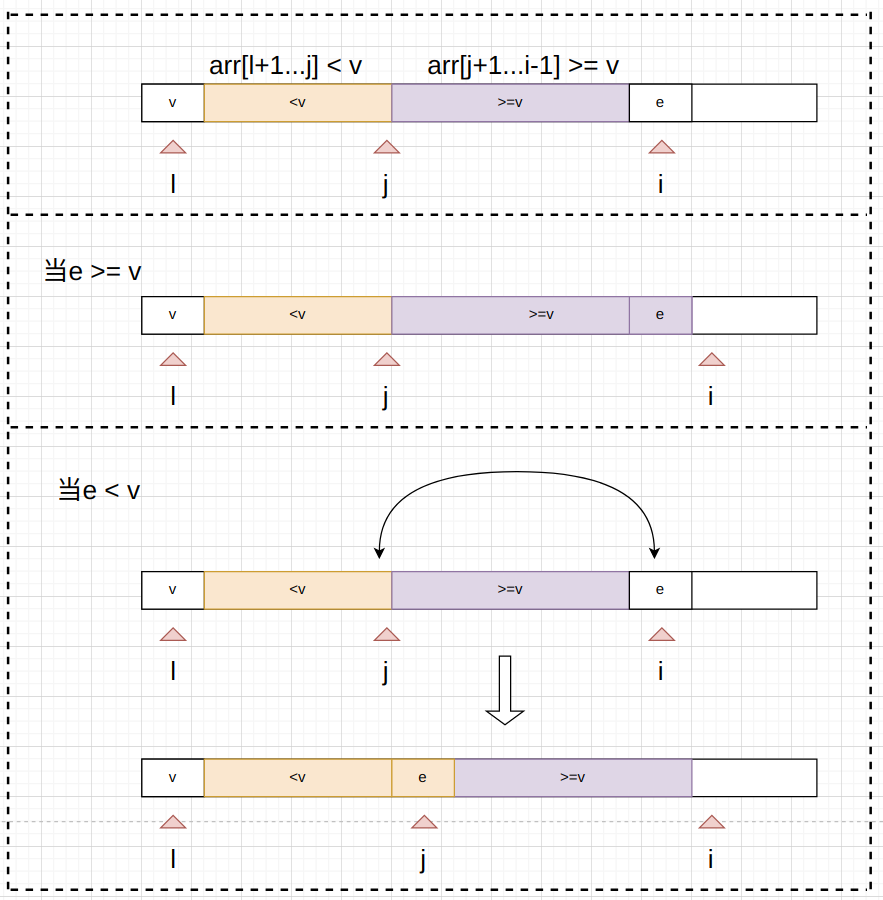
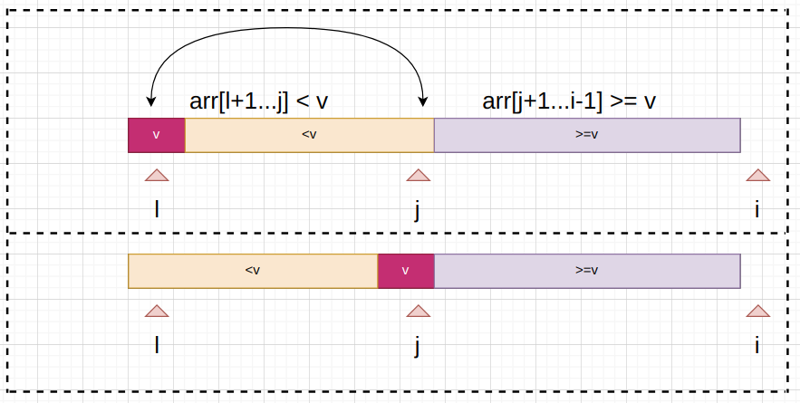
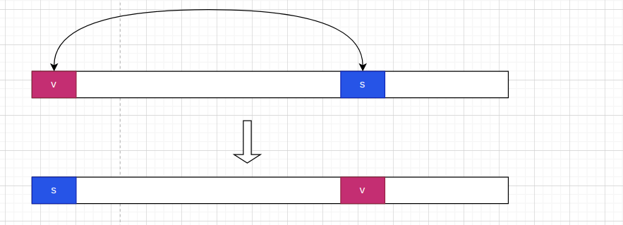
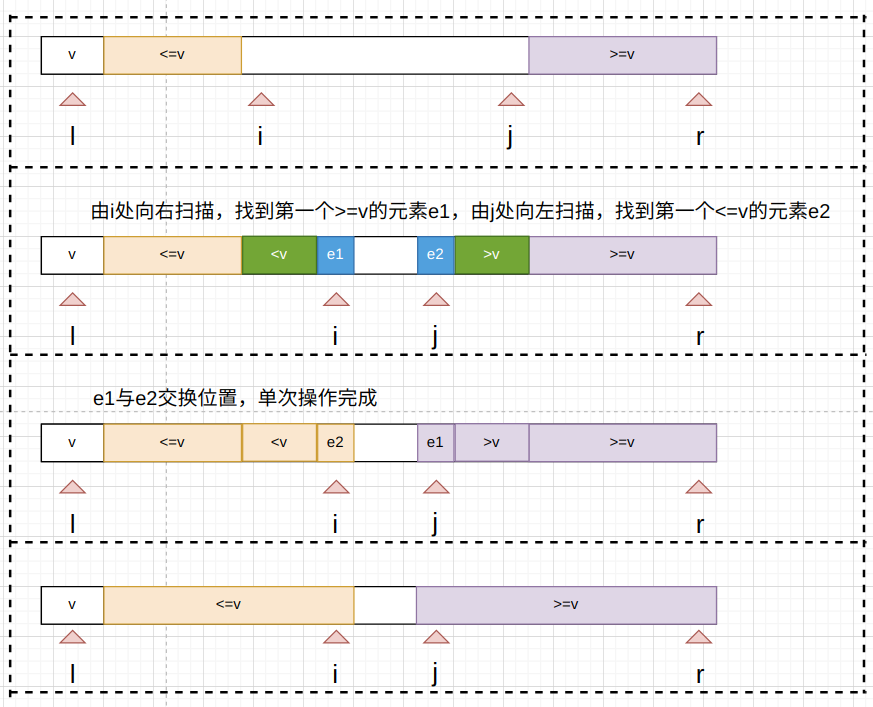
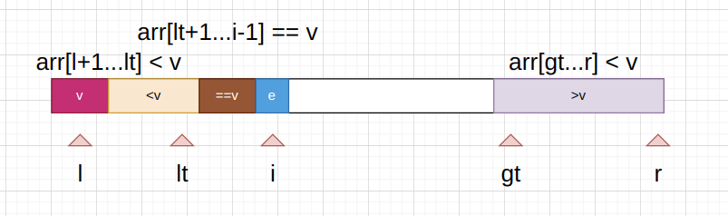

# 排序算法

## 1、 O(n*n)的排序算法

### 1.1、选择法排序



```java
public class SelectionSort {
    void selectionSort(int[] arr) {
        int n = arr.length;
        for (int i = 0; i < n; i++) {
            // 寻找[i,n)区间内的最小值
            int minIndex = i;
            for (int j = i + 1; j < n; j++) {
                if (arr[j] < arr[minIndex]) {
                    minIndex = j;
                }
            }
            int temp = arr[minIndex];
            arr[minIndex] = arr[i];
            arr[i] = temp;
        }
        for (int i = 0; i < n; i++) {
            System.out.print(String.format("%d ", arr[i]));
        }
    }
}
```

### 1.2、插入法排序



```java
public class InsertionSort {
    void insertionSort(int[] arr) {
        for (int i = 1; i < arr.length; i++) {
            int idx = -1;
            for (int j = 0; j <= i - 1; j++) {
                if (arr[j] > arr[i]) {
                    idx = j;
                    break;
                }
            }
            if (idx != -1) {
                int temp = arr[i];
                for (int k = i; k > idx; k--) {
                    arr[k] = arr[k - 1];
                }
                arr[idx] = temp;
            }
        }
        for (int i = 0; i < arr.length; i++) {
            System.out.print(String.format("%d ", arr[i]));
        }
    }
}
```

在数组近乎于有序的情况下，插入法排序效率甚至会优于O(log(n))的排序算法。

## 2、 O(n*log(n))的排序算法

### 2.1、 归并法排序



```java

public class MergeSort {
    void merge(int[] arr, int left, int mid, int right) {
        int[] temp = new int[right - left + 1];
        for (int i = left; i <= right; i++) {
            temp[i - left] = arr[i];
        }
        int i = left;
        int j = mid + 1;
        for (int k = left; k <= right; k++) {
            if (i > mid) {
                arr[k] = temp[j - left];
                j++;
            } else if (j > right) {
                arr[k] = temp[i - left];
                i++;
            } else if (temp[i - left] < temp[j - left]) {
                arr[k] = temp[i - left];
                i++;
            } else {
                arr[k] = temp[j - left];
                j++;
            }
        }
    }

    void mergeSort(int[] arr, int left, int right) {
        if (left >= right) {
            return;
        }
        int mid = (left + right) / 2;
        mergeSort(arr, left, mid);
        mergeSort(arr, mid + 1, right);
        merge(arr, left, mid, right);
    }

    void mergeSort(int[] arr) {
        mergeSort(arr, 0, arr.length - 1);
    }
}
```

### 2.2、 快速法排序

#### 2.2.1、 简单描述

核心思想:将一个数字v整理到正确的位置:1. 其左边的数字都是比v小的 ;2.其右边的数字都是比v大的。



可分为如下三个步骤:

1. 以第一个元素为v,逐步切割整个数组



2. 整个数组切分完毕后，将v放在数组中间



3. 将 **<v** 和 **>v** 这两部分的子数组递归进行快速法排序

#### 2.2.2、随机化改良

当整个数组近乎有序的情况下，以首元素为v，将会出现 **<v** 和 **>v** 这两个子数组不平衡的情况,这样算法会退步为 **O(n*n)** 的复杂度。解决方案:随机选择一个元素作为v。



代码如下:

```java
public class QuickSort1 {
    /**
     * 对于arr[l...r]部分进行partition操作
     * @param arr
     * @param l
     * @param r
     * @return 返回p,使得arr[l...p-1] < arr[p] ;arr[p+1,r] > arr[p]
     */
    int partition(int[] arr,int l, int r){
        SortUtil.swap(arr ,l , l +new Random().nextInt(r - l) );
        int v = arr[l];
        int j = l;
        for(int i = l + 1; i <= r ; i ++){
            if(arr[i] < v){
                SortUtil.swap(arr,j+1,i);
                j = j + 1;
            }
        }
        SortUtil.swap(arr,l,j);
        return j;
    }
    void quickSort(int[] arr,int l,int r){
        /**
         * 高级的排序算法在最小处都可以用插入法排序优化
         */
        if(r - l <= 15){
            new InsertionSort().insertionSort(arr ,l,r);
            return;
        }
        int p = partition(arr,l,r);
        quickSort(arr,l ,p-1);
        quickSort(arr,p+1 , r);
    }
}
```

#### 2.2.3、 双路快速法排序改良

当数组中存在大量重复元素的情况下，也会发生不平衡的状况。 双路快速排序排序会将和v相同的元素均匀分布在两条路径中。



代码如下:

```java

public class QuickSort2 {

    /**
     * 对于arr[l...r]部分进行partition操作
     * @param arr
     * @param l
     * @param r
     * @return 返回p,使得arr[l...p-1] < arr[p] ;arr[p+1,r] > arr[p]
     */
    int partition(int[] arr,int l, int r){
        SortUtil.swap(arr ,l , l +new Random().nextInt(r - l) );
        int v = arr[l];

        // arr[l+1 ... i) < v; arr(j ... r] >= v
        int i = l + 1,j = r;
        while (true){
            while(i <= r && arr[i] < v){
                i ++;
            }
            while( j >= l + 1&& arr[j] > v){
                j --;
            }
            if( i > j){
                break;
            }
            SortUtil.swap(arr,i,j);
            i ++;
            j --;
        }

        SortUtil.swap(arr,l,j);
        return j;
    }
    void quickSort(int[] arr,int l,int r){
        /**
         * 高级的排序算法在最小处都可以用插入法排序优化
         */
        if(r - l <= 15){
            new InsertionSort().insertionSort(arr ,l,r);
            return;
        }
        int p = partition(arr,l,r);
        quickSort(arr,l ,p-1);
        quickSort(arr,p+1 , r);
    }
}
```

#### 2.2.4、 三路快速排序法改良

在二路快速排序法的基础上，增加 **==v** 的区域

